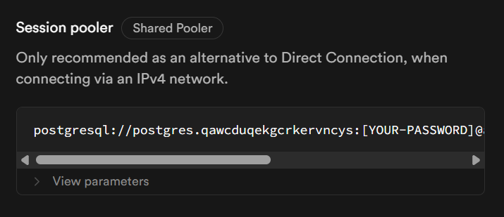

# Aplicação de saúde de pacientes
<p> Aplicação desenvolvida usando NodeJS e Express com o padrão MVC, sob orientação de Afonso Brandão, professor do Instituto de Tecnologia e Liderança (Inteli). Em linhas gerais, esse site possibilita o cadastro de feridas e sintomas de pacientes, gerando relatórios referentes a isso.</p>

# Como rodar o projeto localmente?
&nbsp; &nbsp; &nbsp; &nbsp;Primeiramente, certifique-se de atender aos seguintes pré-requisitos:
Node.js (v18+)
PostgreSQL (v15+)
Git

&nbsp; &nbsp; &nbsp; &nbsp;Após tal averiguação, siga os seguintes passos:

## Parte 1: instalação

1) Clone o projeto
```
git clone https://github.com/luanalima77/Aplicacao-de-saude-com-arquitetura-MVC.git
```
<br>

2) Instale as dependências

&nbsp; &nbsp; &nbsp; &nbsp;**Instale todas as dependências, se não o projeto pode não rodar conforme o esperado.** <br>

&nbsp; &nbsp; &nbsp; &nbsp;Dependências do Node:

```
npm install
```
<br>

&nbsp; &nbsp; &nbsp; &nbsp;Dependências do PostgreSQL:
```
npm install pg
```
<br>

&nbsp; &nbsp; &nbsp; &nbsp;Dependências do .env:
```
npm install dotenv
```
<br>

&nbsp; &nbsp; &nbsp; &nbsp;Dependências do ejs (que são os arquivos das views do projeto):
```
npm install ejs
```

<br><br>

## Parte 2: configuração do banco de dados
1) Faça a configuração das variáveis de ambiente necessárias, a exemplo das configurações do banco de dados PostgreSQL. No caso deste projeto, usou-se o Supabase para armazenar os dados. Dessa forma, renomeie o arquivo .env.example para .env e insira isso nele: 

```
DB_USER=
DB_HOST=
DB_DATABASE=
DB_PASSWORD=
DB_PORT=
DB_SSL=
PORT=
```

&nbsp; &nbsp; &nbsp; &nbsp;Detalhe importante: a porta (PORT) que está sendo usada neste projeto é a 3000. As outras configurações podem ser conferidas dentro do próprio site do Supabase. <br>
&nbsp; &nbsp; &nbsp; &nbsp;Para isso, procure pelo botão "Connect" ao entrar no Supabase: 


<br> <br>

&nbsp; &nbsp; &nbsp; &nbsp;Depois, procure por "Session pooler" e clique em "View parameters". Lá, vão estar todos os dados necessários para colocar no .env e, assim, conectar o seu banco de dados ao projeto:

<br>

2) Depois, execute o script SQL de inicialização no terminal:
```
npm run init-db
```

3) Depois de seguir esses passos, execute o seguinte comando no terminal:
```
node server.js
```
